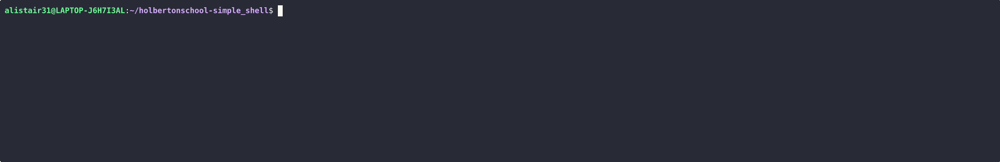
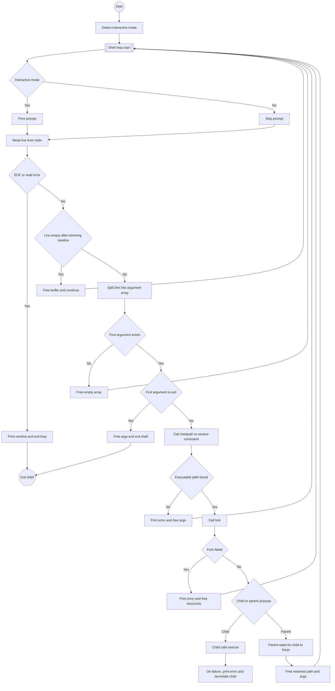

<a name="readme-top"></a>

<!-- PROJECT LOGO -->
<br />
<div align="center">
  <a href="https://github.com/Alistair/holbertonschool-simple_shell">
    
  </a>

  <h1>Simple Shell</h1>
  <p>A minimal Unix-like shell written in C that reads commands, resolves paths, and executes programs.</p>

  <!-- BADGES -->
  <p>
    <a href="https://github.com/Alistair31/holbertonschool-simple_shell/graphs/contributors">
      
    </a>
  </p>
  
  <!-- Demo GIF -->
  
</div>
<!-- TABLE OF CONTENTS -->
<details>
  <summary>Table of Contents</summary>
  <ol>
    <li>
      <a href="#about-the-project">About The Project</a>
      <ul>
        <li><a href="#built-with">Built With</a></li>
        <li><a href="#component-summary">Component Summary</a></li>
        <li><a href="#architecture-overview">Architecture Overview</a></li>
        <li><a href="#source-files">Source Files</a></li>
      </ul>
    </li>
    <li>
      <a href="#getting-started">Getting Started</a>
      <ul>
        <li><a href="#prerequisites">Prerequisites</a></li>
        <li><a href="#installation">Installation</a></li>
      </ul>
    </li>
    <li><a href="#usage">Usage</a></li>
    <li><a href="#roadmap">Roadmap</a></li>
    <li><a href="#license">License</a></li>
    <li><a href="#contact">Contact</a></li>
    <li><a href="#acknowledgments">Acknowledgments</a></li>
  </ol>
</details>

## About The Project

The simple shell is a minimal Unix-like shell in C. It reads user input, resolves executable paths, and spawns processes to run commands.  
The shell supports a small subset of POSIX shell behavior, focused on process creation and simple argument handling.  
The implementation is intentionally compact and educational. It is suitable for learning how shells interact with the operating system via `fork`, `execve`, and related system calls.

<p align="right">(<a href="#simple-shell">back to top</a>)</p>

### Built With

This shell relies on standard POSIX APIs and a C toolchain. You can build and run it on most Unix-like systems.

- C language
- POSIX system calls (fork, execve, access, wait, isatty)
- Standard C library
- A C compiler such as `gcc` or `clang`

<p align="right">(<a href="#simple-shell">back to top</a>)</p>

### Component Summary

This table lists core files and their responsibilities. Each file encapsulates a focused part of the shell behavior.

| File           | Key Function  | Description                                             |
| -------------- | ------------- | ------------------------------------------------------- |
| `simple_shell.c` | `main`, `command` | Entry point; reads input and handles command execution |
| `bunchwords.c`   | `bunchwords`      | Reads a line, prompts user, and returns token array     |
| `split_words.c`  | `split_words`     | Splits a string into individual words                   |
| `shellpath.c`    | `shellpath`       | Searches standard paths to locate executable commands   |

<p align="right">(<a href="#simple-shell">back to top</a>)</p>

### Architecture Overview

This section shows the high-level control flow and how user input becomes a running process. The flowchart highlights input handling, built-in commands, error paths, and cleanup.



- The main loop reads user input, handles interactive prompts, and detects EOF.
- Empty input lines are ignored after freeing temporary buffers.
- The `exit` token is treated as a built-in and terminates the shell.
- External commands go through path resolution, forking, execution, waiting, and cleanup.

<p align="right">(<a href="#simple-shell">back to top</a>)</p>

### Source Files

This section documents each source file, its responsibilities, and its main functions. It helps you navigate the codebase and understand where each behavior lives.

#### `simple_shell.c`

This file contains the shell’s main entry point and execution logic. It controls the main loop and delegates input parsing and command execution to helper functions.

##### `main`

The **`main`** function loops reading user commands until exit. It decides whether the shell runs in interactive mode and manages the lifecycle of the input arrays.

- Checks interactive mode via `isatty(STDIN_FILENO)` before entering the loop.
- Calls `bunchwords` to read and parse each line into an argument array.
- Exits on EOF or when the first token is exactly `"exit"`.
- Invokes `command` for non-empty, non-exit commands.

##### `command`

The **`command`** function resolves and executes external commands. It also contains an internal check for the `exit` keyword as a last-resort built-in.

- Scans arguments for the token `"exit"` and exits with code `2` after freeing memory.
- Uses `shellpath` to resolve the executable’s full path from predefined directories.
- Calls `fork` and then `execve` in the child process, with error reporting on failure.
- Waits for the child in the parent, then frees both the resolved path and the argument array.

#### `bunchwords.c`

This file reads a line from `stdin`, displays a prompt if interactive, and returns tokenized input. It is the user input front-end for the shell loop.

##### `bunchwords`

The **`bunchwords`** function handles input reading and initial parsing. It centralizes prompt display, newline trimming, EOF detection, and handing off to the tokenizer.

- Prints the `$ ` prompt when `interactive` is non-zero.
- Uses `getline` to read an entire line, then trims a trailing newline if present.
- Returns a dynamically allocated array with a single `NULL` entry for empty lines.
- Delegates non-empty strings to `split_words`, frees the original buffer, and returns tokens.

#### `split_words.c`

This file splits a single string into words separated by spaces. It provides a simple tokenizer used by the shell to convert raw input into `argv`-like arrays.

##### `split_words`

The **`split_words`** function tokenizes the input string. It estimates the number of tokens, allocates an array, and uses `strtok` for actual splitting.

- Counts spaces in the input string to approximate the number of words.
- Allocates an array of `char *` large enough for all words plus a `NULL` terminator.
- Uses `strtok` with `" "` as the delimiter and duplicates each token using `strdup`.
- Stores a terminating `NULL` pointer so callers can iterate over the array safely.

#### `shellpath.c`

This file constructs the full filesystem path for a given command name. It mimics a very small subset of `PATH` search logic using a hardcoded search string.

##### `shellpath`

The **`shellpath`** function searches predefined directories for executables. It supports both commands that already contain slashes and bare command names.

- Immediately returns `NULL` when `cmd` is `NULL` or an empty string.
- If `cmd` contains `/`, calls `access(cmd, X_OK)` and returns a duplicated path on success.
- Duplicates a colon-separated search string and iterates with `strtok` over each directory.
- Builds candidate paths, tests them with `access`, returns the first executable path, or `NULL` otherwise.

##### PATH Directories

This table lists the default search paths. They are used in order from left to right until an executable is found.

| Directory      |
| -------------- |
| `/usr/local/bin` |
| `/usr/bin`       |
| `/sbin`          |
| `/usr/sbin`      |

<p align="right">(<a href="#simple-shell">back to top</a>)</p>

<!-- GETTING STARTED -->
## Getting Started

This section explains how to set up the simple shell locally. You will clone the repository, build the binary with a C compiler, and run it from your terminal.

### Prerequisites

You need a POSIX-like environment and a working C toolchain. Most Linux distributions and macOS systems already provide what you need.

- A C compiler such as `gcc`:

  ```bash
  gcc --version
  ```

- Standard build tools and headers for your platform.
- A terminal emulator and basic command-line familiarity.

<p align="right">(<a href="#simple-shell">back to top</a>)</p>

### Installation

Follow these steps to download, compile, and run the shell. All commands should run in your terminal.

1. Clone the repository:

   ```bash
   git clone https://github.com/github_username/repo_name.git
   cd repo_name
   ```

2. Compile the sources into a single executable:

   ```bash
   gcc -Wall -Werror -Wextra -pedantic *.c -o simple_shell
   ```

3. Run the shell from the build directory:

   ```bash
   ./simple_shell
   ```

4. Optionally add the build directory to your `PATH`:

   ```bash
   export PATH="$PWD:$PATH"
   ```

<p align="right">(<a href="#simple-shell">back to top</a>)</p>

<!-- USAGE EXAMPLES -->
## Usage

This shell reads commands from standard input, resolves their paths, and executes them in child processes. It supports both interactive and non-interactive modes.

- In interactive mode, you see a `$ ` prompt and can type commands.
- In non-interactive mode, the shell reads commands from a pipe or file.
- The `exit` command terminates the shell and frees all allocated memory.
- Any other token is treated as a program name to execute with optional arguments.

Example interactive session:

```bash
./simple_shell
$ ls
simple_shell  simple_shell.c  shellpath.c  bunchwords.c  split_words.c
$ echo Hello world
Hello world
$ exit
```

For a visual overview of the runtime behavior, refer to the detailed flowchart in the [Architecture Overview](#architecture-overview) section. That diagram shows how the shell handles prompts, input lines, built-ins, external commands, and errors.

<p align="right">(<a href="#simple-shell">back to top</a>)</p>

<!-- ROADMAP -->
## Roadmap

The current implementation focuses on a minimal and educational subset of shell behavior. You can extend it into a more complete shell by adding features.

- [ ] Support environment variables and `PATH` from the environment
- [ ] Implement more built-in commands
- [ ] Add advanced parsing such as quotes and redirection
- [ ] Support pipelines and background processes

See the [open issues](https://github.com/github_username/repo_name/issues) for a full list of proposed features and known issues.

<p align="right">(<a href="#simple-shell">back to top</a>)</p>

<!-- LICENSE -->
## License

Distributed under the project_license. See `LICENSE.txt` for more information. You can adapt the license file to match your preferred open source license.

<p align="right">(<a href="#simple-shell">back to top</a>)</p>

<!-- CONTACT -->
## Contact

Your Name - [@twitter_handle](https://twitter.com/twitter_handle) - email@email_client.com  

Project Link: [https://github.com/github_username/repo_name](https://github.com/github_username/repo_name)

<p align="right">(<a href="#simple-shell">back to top</a>)</p>

<!-- ACKNOWLEDGMENTS -->
## Acknowledgments

Use this section to credit resources or people that helped the project. You can list tutorials, documentation, or mentors here.

- []()
- []()
- []()

<p align="right">(<a href="#readme-top">back to top</a>)</p>
