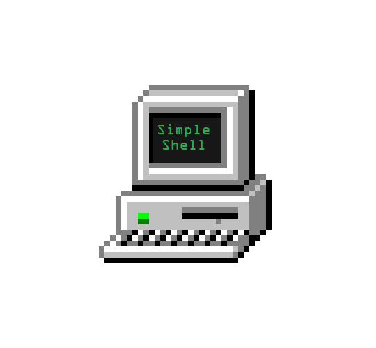
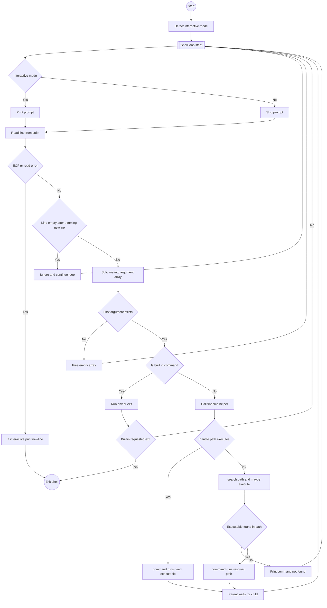

<a name="readme-top"></a>

<!-- PROJECT LOGO -->
<br />
<div align="center">
  <a href="https://github.com/Alistair/holbertonschool-simple_shell">
    
  </a>

  <p>A minimal Unix-like shell written in C that reads commands, resolves paths, and executes programs.</p>

  <!-- BADGES -->
  <p align="center">
    <a href="https://github.com/Handroc"></a>
    <a href="https://github.com/Alistair31/holbertonschool-simple_shell/graphs/contributors"></a>
    <a href="https://github.com/Alistair31"></a>
  </p>
  
</div>

<!-- TABLE OF CONTENTS -->
<details>
  <summary><h2>Table of Contents</h2></summary>
  <ol>
    <li><a href="#about-the-project">About The Project</a>
    <li><a href="#built-with">Built With</a></li>
    <li><a href="#component-summary">Component Summary</a></li>
    <li><a href="#flowchart">Flowchart</a></l
    <li><a href="#getting-started">Getting Started</a>
    <li><a href="#prerequisites">Prerequisites</a></li>
    <li><a href="#installation">Installation</a></li>
    <li><a href="#usage">Usage</a></li>
    <li><a href="#roadmap">Roadmap</a></li>
    <li><a href="#contact">Contact</a></li>
    <li><a href="#acknowledgments">Acknowledgments</a></li>
  </ol>
</details>

<u>## About The Project

The simple shell is a minimal Unix-like shell in C. It reads user input, resolves executable paths, and spawns processes to run commands.  
The shell supports a small subset of POSIX shell behavior, focused on process creation and simple argument handling.  
The implementation is intentionally compact and educational. It is suitable for learning how shells interact with the operating system via `fork`, `execve`, and related system calls.

<p align="right">(<a href="#simple-shell">back to top</a>)</p>

<u>## Built With

<div align="center">
  
[](https://en.wikipedia.org/wiki/C_(programming_language))
[](https://code.visualstudio.com/)

</div>
This shell relies on standard POSIX APIs and a C toolchain. You can build and run it on most Unix-like systems.  

<p align="right">(<a href="#simple-shell">back to top</a>)</p>

<u>## Component Summary

This table lists core files and their responsibilities. Each file encapsulates a focused part of the shell behavior.

| File              | Key Functions                    | Description                                   |
|-------------------|----------------------------------|-----------------------------------------------|
| `findpath_cmd.c`  | `findcmd`, `get_path`            | Finds and dispatches commands via path logic  |
| `command.c`       | `command`                        | Forks and executes given commands             |
| `cmdinpath.c`     | Path building, search, execution | Resolves commands in PATH, handles direct exec|
| `_builtin.c`      | `_builtin`, `builtin_exit/env`   | Implements built-in commands                  |
| `man.h`           | Prototypes, includes             | Main project header                           |
| `splitwords.c`    | `split_words`, `split_line`      | Tokenizes user input                          |
| `utils.c`         | `makeenv`, `free_args`, `_strdup`| Utility for memory and string ops             |
| `simple_shell.c`  | `main`                           | Entry point and main shell loop               |

<p align="right">(<a href="#simple-shell">back to top</a>)</p>

<u>## Flowchart

This section shows the high-level control flow and how user input becomes a running process. The flowchart highlights input handling, built-in commands, error paths, and cleanup.



- The main loop reads user input, handles interactive prompts, and detects EOF.
- Empty input lines are ignored after freeing temporary buffers.
- The `exit` token is treated as a built-in and terminates the shell.
- External commands go through path resolution, forking, execution, waiting, and cleanup.

<p align="right">(<a href="#simple-shell">back to top</a>)</p>

<!-- GETTING STARTED -->
<u>## Getting Started

This section explains how to set up the simple shell locally. You will clone the repository, build the binary with a C compiler, and run it from your terminal.

<u>### Prerequisites</u>

You need a POSIX-like environment and a working C toolchain. Most Linux distributions and macOS systems already provide what you need.

- A C compiler such as `gcc`:

  ```bash
  gcc --version
  ```

- Standard build tools and headers for your platform.
- A terminal emulator and basic command-line familiarity. We used VScode

<p align="right">(<a href="#simple-shell">back to top</a>)</p>

<u>### Installation

Follow these steps to download, compile, and run the shell. All commands should run in your terminal.

1. Clone the repository:

   ```bash
   git clone https://github.com/Alistair31/holbertonschool-simple_shell.git
   cd holbertonschool-simple_shell
   ```

2. Compile the sources into a single executable:

   ```bash
   gcc -Wall -Werror -Wextra -pedantic *.c -o simple_shell
   ```
   
3. Run the shell from the build directory:

   ```bash
   ./simple_shell
   ```

4. Optionally add the build directory to your `PATH`:

   ```bash
   export PATH="$PWD:$PATH"
   ```

<p align="right">(<a href="#simple-shell">back to top</a>)</p>

<!-- USAGE EXAMPLES -->
## Usage

This shell reads commands from standard input, resolves their paths, and executes them in child processes. It supports both interactive and non-interactive modes.

- In interactive mode, you see a `$ ` prompt and can type commands.
- In non-interactive mode, the shell reads commands from a pipe or file.
- The `exit` command terminates the shell and frees all allocated memory.
- Any other token is treated as a program name to execute with optional arguments.

Example interactive session:

```bash
./simple_shell
$ ls
simple_shell  simple_shell.c  shellpath.c  bunchwords.c  split_words.c
$ echo Hello world
Hello world
$ exit
```


Example of non interactive test:

On your own terminal you can use in a non interactive way this simple shell.  
Type echo "executable" | ./simple_shell and it would execute it without entering in the simple shell


As you can see it can execute some command 

For a visual overview of the runtime behavior, refer to the detailed flowchart in the [Flowchart](#flowchart) section. That diagram shows how the shell handles prompts, input lines, built-ins, external commands, and errors.

<p align="right">(<a href="#simple-shell">back to top</a>)</p>

<!-- ROADMAP -->
## Roadmap

<p align="right">(<a href="#simple-shell">back to top</a>)</p>

<!-- CONTACT -->
## Contact

See AUTHOR.TXT file  

<p align="right">(<a href="#simple-shell">back to top</a>)</p>

<!-- ACKNOWLEDGMENTS -->
## Acknowledgments

Use this section to credit resources or people that helped the project. You can list tutorials, documentation, or mentors here.

- [](https://mermaid.js.org/)&nbsp;&nbsp;&nbsp;&nbsp;For the [Flowchart](#flowchart) diagram
- [](https://asciinema.org/)&nbsp;&nbsp;&nbsp;&nbsp;For the demo (GIFs) in the [Usage](#usage) section

<p align="right">(<a href="#readme-top">back to top</a>)</p>
